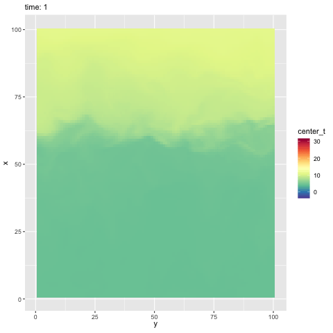

# Turbulent Flow Emulation Repository
## Overview
This repository provides data and code for the study of turbulent flow emulation using Proper Orthogonal Decomposition (POD) and a novel Variational Autoencoder (xVAE). The focus is on capturing complex flow dynamics, including extreme turbulence events, with applications to Large-Eddy Simulation (LES) of a buoyant plume generated during the Mosquito Wildland Fire in California, September 2022.

The XVAE framework is designed to enhance traditional Variational Autoencoders by incorporating max-infinitely divisible (max-id) processes, enabling robust modeling of extremal dependence and efficient uncertainty quantification (UQ). This approach is contrasted with POD, which, while efficient, lacks the ability to capture intermittency and extreme events.

## Data
### Description
The dataset includes high-resolution LES outputs simulating a turbulent buoyant plume under realistic atmospheric conditions. The simulation is performed using a modified version of the Advanced Research Weather Research and Forecast Model (WRF-ARW v4.1) coupled with an LES scheme.

*Simulation Domain*:  8km × 8km × 5km with a uniform Cartesian grid (198 × 198 × 500 nodes).
*Source Details*: A 400m diameter circular source at (39.006$^\circ$N, 120.745$^\circ$W) with a buoyancy flux of 1.07×10 $m^4 s^{−3}$.

*Boundary Conditions*: Periodic side boundaries, constant-pressure top boundary.
Temporal Resolution: Data recorded every 30 seconds for a total duration of 50 minutes (100 time steps).
Planar Data Extraction: Data are extracted from the $x-z$ plane at $y=99$ grid points (4 km).

## Code
### Main Components

1. *POD Implementation*

- Extracts dominant energetic structures from the turbulent flow fields using the eigenfunctions of the two-point correlation tensor.
- Designed to efficiently emulate flow fields but without extreme-event modeling.

2. *XVAE Framework*

- Incorporates max-infinitely divisible processes into the VAE structure to account for extremes and dependent structures in turbulent flow.
- Allows for uncertainty quantification and generation of new data realizations.
- Extended to handle 3D-indexed data for modeling the evolution of turbulent plumes in all spatial directions.

3. *LES Simulation Integration*

Interfaces with the WRF-ARW LES outputs to analyze and visualize flow fields.
Preprocessing scripts to transform LES outputs into input data for the POD and XVAE models.
