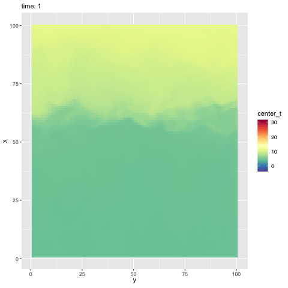

p# Turbulent Flow Emulation Repository
# Turbulent Flow Emulation Repository

## Overview

This repository contains data and code for statistical emulation of turbulent large-eddy simulation (LES) plume fields using three approaches:

- **POD** (Proper Orthogonal Decomposition),
- **vanilla \(\beta\)-VAE** (a baseline variational autoencoder), and
- **xVAE** (an extreme-value variational autoencoder that incorporates max-infinitely divisible structure).

The goal is to emulate high-dimensional turbulent flow fields while preserving important tail behavior, spatial dependence, and uncertainty structure. The repository now includes analyses for **two LES variables**:

1. **Fluid density**, which exhibits stronger temporal evolution, intermittency, and plume spreading.
2. **Vertical velocity**, which exhibits a more persistent updraft structure after the plume reaches a quasi-stationary regime.

The repository is organized so that each variable has its own data and analysis scripts. For the fluid-density study, we compare **POD**, **xVAE**, and **vanilla \(\beta\)-VAE**. For the vertical-velocity study, we compare **POD** and **xVAE**.

---

## Repository structure

plume_analysis/
├── R/
│   ├── Fluid density/
│   │   ├── vanilla VAE/
│   │   │   ├── (CV) centerline_analysis_fire_w_vanilla_VAE.R
│   │   │   ├── CV_vanillaVAE_tailRMSE.R
│   │   │   ├── centerline_analysis_fire_w_vanilla_VAE.R
│   │   │   ├── emp_chi_on_grid_vanilla_VAE.R
│   │   │   └── generateEmulationCompPlots_vanilla_VAE.R
│   │   ├── (CV) centerline_analysis_fire_w_NMF.R
│   │   ├── CV_XVAE_tailRMSE.R
│   │   ├── NMF_new.py
│   │   ├── POD_centerline_analysis_fire.R
│   │   ├── centerline_analysis_fire_w_NMF.R
│   │   ├── emp_chi_on_grid.R
│   │   ├── generateEmulationCompPlots.R
│   │   ├── generateQQplot.R
│   │   ├── structure_function.R
│   │   └── utils.R
│   └── Vertical velocity/
│       ├── (CV) centerline_analysis_fire_w_NMF.R
│       ├── CV_XVAE_tailRMSE.R
│       ├── NMF_new.py
│       ├── POD_centerline_analysis_fire.R
│       ├── centerline_analysis_fire_w_NMF.R
│       ├── csv_for_python_NMF.R
│       ├── emp_chi_on_grid.R
│       ├── generateEmulationCompPlots.R
│       ├── generateQQplot.R
│       ├── structure_function.R
│       └── utils.R
├── data/
│   ├── Fluid density/
│   └── Vertical velocity/
├── www/
├── LICENSE
└── README.md

## Data
### Description
The dataset includes high-resolution LES outputs simulating a turbulent buoyant plume under realistic atmospheric conditions. The simulation is performed using a modified version of the Advanced Research Weather Research and Forecast Model (WRF-ARW v4.1) coupled with an LES scheme.

*Simulation Domain*:  8km × 8km × 5km with a uniform Cartesian grid (198 × 198 × 500 nodes).
*Source Details*: A 400m diameter circular source at (39.006$^\circ$N, 120.745$^\circ$W) with a buoyancy flux of 1.07×10 $m^4 s^{−3}$.

*Boundary Conditions*: Periodic side boundaries, constant-pressure top boundary.
Temporal Resolution: Data recorded every 30 seconds for a total duration of 50 minutes (100 time steps).
Planar Data Extraction: Data are extracted from the $x-z$ plane at $y=99$ grid points (4 km).

## Code
### Main Components

1. *POD Implementation*

- Extracts dominant energetic structures from the turbulent flow fields using the eigenfunctions of the two-point correlation tensor.
- Designed to efficiently emulate flow fields but without extreme-event modeling.

2. *XVAE Framework*

- Incorporates max-infinitely divisible processes into the VAE structure to account for extremes and dependent structures in turbulent flow.
- Allows for uncertainty quantification and generation of new data realizations.
- Extended to handle 3D-indexed data for modeling the evolution of turbulent plumes in all spatial directions.

3. *LES Simulation Integration*

Interfaces with the WRF-ARW LES outputs to analyze and visualize flow fields.
Preprocessing scripts to transform LES outputs into input data for the POD and XVAE models.
